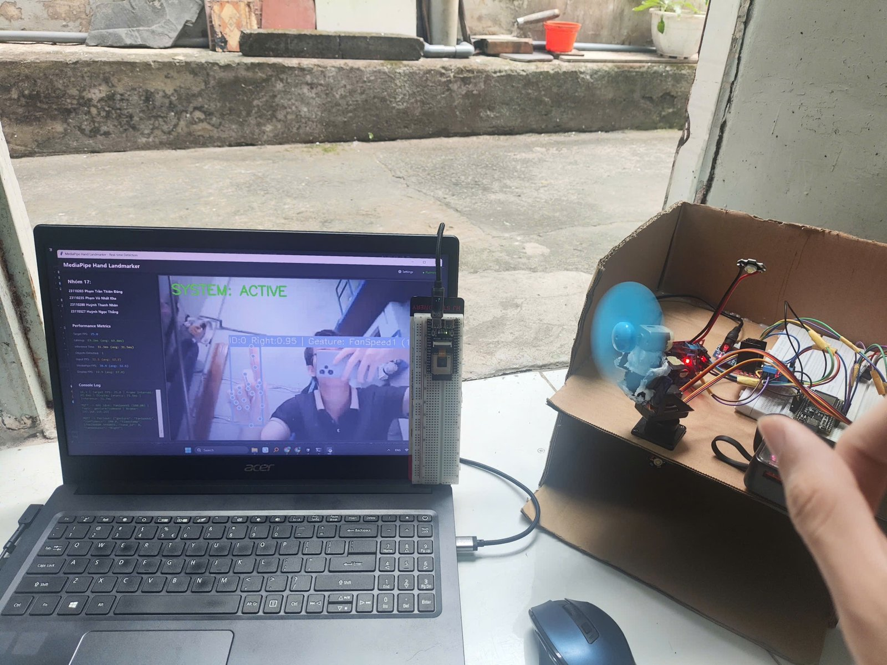
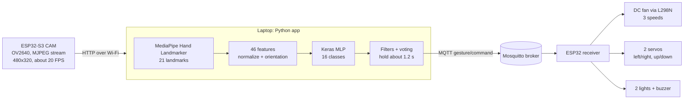
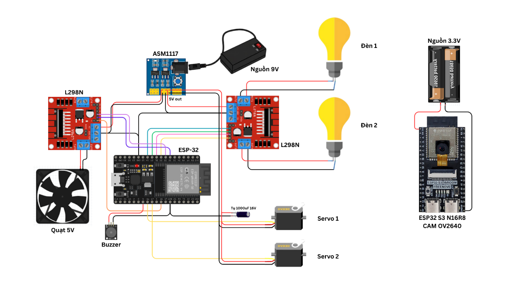

# Hand Gesture IoT Control

Controls a small fan and two lights with hand gestures. An ESP32-CAM streams video to a laptop, a MediaPipe + TensorFlow pipeline recognizes 15 hand gestures, and the commands go over MQTT to a second ESP32 that drives the fan motor, two servos, the lights and a buzzer.

This is a course project for Digital Image Processing at HCM-UTE (team of 4, 2025). The full report is in Vietnamese: [17_BaoCao.pdf](17_BaoCao.pdf).

Trained model on Hugging Face: [hand-gesture-iot-control](https://huggingface.co/TicassloThang/hand-gesture-iot-control).



## Overview

- Collected 18,639 photos of 16 classes (15 gestures and "no gesture") from team members, in different places and lighting, with a small Tkinter tool that only saves a frame when MediaPipe finds all 21 hand landmarks.
- Turned each photo into 46 numbers: 21 landmarks (x, y) relative to the wrist and scaled by hand size, plus two vectors for the hand's orientation. Mirrored the photos of symmetric gestures so both hands work, which gives 29,648 samples.
- Trained a small fully connected network (TensorFlow/Keras) on these features. On 1,282 separate test photos, the full pipeline gets 96.9% of them right (98.3% if the 18 photos where no hand was found are left out).
- Built the real-time side: frame smoothing, confidence and entropy checks, and a voting window so a command is only sent after the gesture is held steady for about 1.2 seconds.
- Built the hardware and firmware: an ESP32-S3 camera board streaming MJPEG over Wi-Fi, and an ESP32 that receives MQTT commands and finds the broker on the network by itself with mDNS.

## How it works



### Gestures

| Command | Gesture | What it does |
|---|---|---|
| Start | Open palm facing the camera | Turns on recognition (buzzer beeps twice) |
| FanOff | Open palm, back of the hand to the camera | Stops the fan |
| FanSpeed1/2/3 | 1, 2 or 3 fingers up | Fan at 30%, 65% or 100% |
| FanLeft, FanRight | Thumb to the side, other fingers closed | Turns the fan left or right (one step) |
| FanUp, FanDown | Thumbs up, thumbs down | Tilts the fan up or down (one step) |
| Light1On, Light1Off | L shape with thumb and index finger, pointing up or down | Light 1 on or off |
| Light2On, Light2Off | L shape with thumb and two fingers, pointing up or down | Light 2 on or off |
| Nothing | No hand | Ignored |

FanLeft and FanRight depend on which hand is used, so they have separate classes for the left and right hand. The other gestures are symmetric and were mirrored during data preparation.

### Data and features

1. **Collection** (`UI/Step1_DataCollection`): about 1,000 to 1,600 photos per class at 640x640.
2. **Preprocessing and extraction** (`UI/Step2_...`): light white balance, adaptive gamma and a 3x3 Gaussian blur before running MediaPipe. A photo is skipped if MediaPipe does not find exactly one hand, or if the detected hand (left or right) does not match the label. Landmarks are moved so the wrist is at (0, 0) and scaled to [-1, 1]. Two extra vectors give the hand's direction: wrist to the middle of the 4 knuckles, and index knuckle to pinky knuckle.
3. **Training** (`UI/Step3+4_...`, run on Google Colab):

| Setting | Value |
|---|---|
| Model | Dense 256, 128, 64 with batch norm and dropout (0.4, 0.3), softmax over 16 classes |
| Split | 70% train, 15% validation, 15% test, random and stratified by class |
| Augmentation (train only) | Random rotation of the landmarks (up to 8 degrees) and Gaussian noise (std 0.003) |
| Training | Adam, learning rate 1e-3, batch 128, up to 120 epochs with early stopping on validation accuracy, class weights |
| Framework | TensorFlow 2.16.1, exported as a SavedModel |

### Real-time filtering

A single frame is not enough to trigger a device, so the app adds several checks before it sends a command:

- Landmarks are smoothed between frames (exponential moving average, alpha 0.5).
- A prediction is rejected if its top probability is below 0.85, if the probability spread is too wide (entropy above 2.0), or if the hand orientation vectors are too short to trust.
- A gesture is accepted only when it gets at least 7 votes, 80% of the votes in the last 2 seconds agree, and it has been held for at least 1.2 seconds.
- The system starts idle and only reacts to Start. After 20 seconds without a new gesture it goes back to idle.
- Over MQTT, a command is sent once when the gesture changes. Holding a direction gesture repeats it every 1.5 seconds so the fan keeps turning step by step.

### Hardware



- **Camera**: ESP32-S3 with OV2640, HVGA (480x320) JPEG frames, capped at about 20 FPS to avoid overheating, reachable at `http://esp32-cam.local/stream`.
- **Receiver**: ESP32 with two L298N drivers (fan with a soft speed ramp, two lights), two SG90 servos (pan 50/90/130 degrees, tilt 0/35/70 degrees) and a buzzer. It looks up the MQTT broker with mDNS and falls back to a fixed IP if that fails.

## Results

The model was tested on 1,282 photos taken separately from the training data (16 classes, 51 to 126 photos each), Each photo goes through MediaPipe, the feature step and the classifier on its own, without the frame smoothing and voting of the live app, and with looser rejection thresholds (0.5 confidence, 2.5 entropy) than the live app uses. For the "no gesture" class, a photo with no hand found counts as correct.

| Outcome | Photos | Share |
|---|---|---|
| Correct | 1,242 | 96.9% |
| Wrong class | 22 | 1.7% |
| No hand detected by MediaPipe | 18 | 1.4% |

Leaving out the 18 photos where MediaPipe found no hand, 98.3% (1,242 of 1,264) are correct. This is the 98.26% given in the report.


The most common mistakes are between gestures that look alike: FanSpeed3 and Light2On (both use the thumb and two fingers), and FanOff and Start (the same open hand, front or back).

During training, validation accuracy reached about 99.5%. That number is optimistic, because the split was random by photo: photos taken a moment apart, and the mirrored copy of a photo, can end up in both the training and validation sets. The separate test photos above are a better measure.

## Limitations

- Accuracy drops in low or very bright light and when the hand is turned far from the camera, because it only uses one 2D camera.
- The validation split is random by photo, not by person or session, so it overestimates accuracy (see above).
- The training data comes from our team members only.
- The laptop does the recognition, so the system depends on the Wi-Fi link between the camera, the laptop and the receiver.
- The model in `models/` was exported by an earlier version of the training script: its `metadata.pkl` has no augmentation settings, so we cannot confirm it was trained with the exact settings shown above.

## Tech stack

Python, MediaPipe, TensorFlow/Keras, OpenCV, NumPy, pandas, scikit-learn, Tkinter, MQTT (paho-mqtt, Mosquitto), zeroconf (mDNS), ESP32 and ESP32-S3 (Arduino C++), OV2640, L298N, SG90 servos

## Project structure

```
├── esp32cam_sender/esp32cam_sender.ino   # Camera board: Wi-Fi, MJPEG stream, mDNS
├── esp32_receiver/esp32_receiver.ino     # Receiver: MQTT, fan, servos, lights, buzzer
├── UI/
│   ├── Step0_Requirement/                # Library version check, model metadata check
│   ├── Step1_DataCollection/             # Tkinter tool to collect hand photos
│   ├── Step2_DataExtraction_Normalization_Augmentation/  # Photos -> dataset.csv
│   ├── Step3+4_DataPreprocessing&ModelTraining/          # Training script (Colab)
│   ├── Step5_RealtimePredictiion/        # Real-time app and MQTT publisher
│   └── TemplateUI/                       # Earlier Tkinter templates
├── Data/
│   ├── Dataset/                          # dataset.csv (29,648 samples), training curves
│   └── ThongKe/                          # Test results on 1,282 photos and charts
└── models/                               # Not in git, see below
```

## Run locally

You need Python 3.10 or 3.11, the two ESP32 boards wired as in the diagram, and an MQTT broker ([Mosquitto](https://mosquitto.org/download/)) on the laptop.

1. Install the Python packages:

```bash
pip install tensorflow==2.16.1 mediapipe==0.10.21 numpy==1.26.4 pandas matplotlib scikit-learn paho-mqtt zeroconf pillow
```

2. Download the models into `models/`:

```bash
hf download TicassloThang/hand-gesture-iot-control --local-dir models
```

This gives `models/SavedModel/saved_model_best/`, `models/SavedModel/metadata.pkl` and `models/hand_landmarker.task` (the MediaPipe model from Google). The same files are also on [Google Drive](https://drive.google.com/drive/folders/13sTNsJhthwzoIVg4f3iuINucdpt93TFq?usp=sharing).

3. Flash `esp32cam_sender.ino` to the ESP32-S3 camera board and `esp32_receiver.ino` to the ESP32 with the Arduino IDE. Set your Wi-Fi name and password in both files first.
4. Start Mosquitto with a listener on port 1883 that accepts connections from the local network:

```
listener 1883
allow_anonymous true
```

5. Run the app and do the Start gesture:

```bash
cd UI/Step5_RealtimePredictiion
python tkinter_detection_classification_esp32.py
```

On Windows, `esp32-cam.local` may need Bonjour to resolve. You can also change `SOURCE` in the script to the camera's IP address.

## Dataset

- Training photos (16 folders): [Google Drive](https://drive.google.com/drive/folders/1cQd6MU33mXW4MnGk83NCYJw59eRersYN?usp=sharing)
- Test photos (1,282): [Google Drive](https://drive.google.com/drive/folders/1qXva-ggaNaVdsB1fm_VK402Wg9-mY0RZ?usp=sharing)

## Team

- Huỳnh Ngọc Thắng (team lead): project idea, hardware, ESP32 firmware for the camera and the receiver, MQTT and the real-time control logic
- Phạm Trần Thiên Đăng: data collection and feature extraction
- Phạm Võ Nhất Kha: model design and training
- Huỳnh Thanh Nhân: real-time integration and the user interface

We also helped each other across parts.

## License

[MIT](LICENSE)
